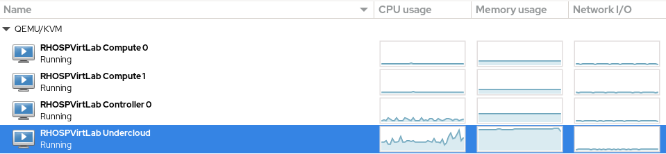
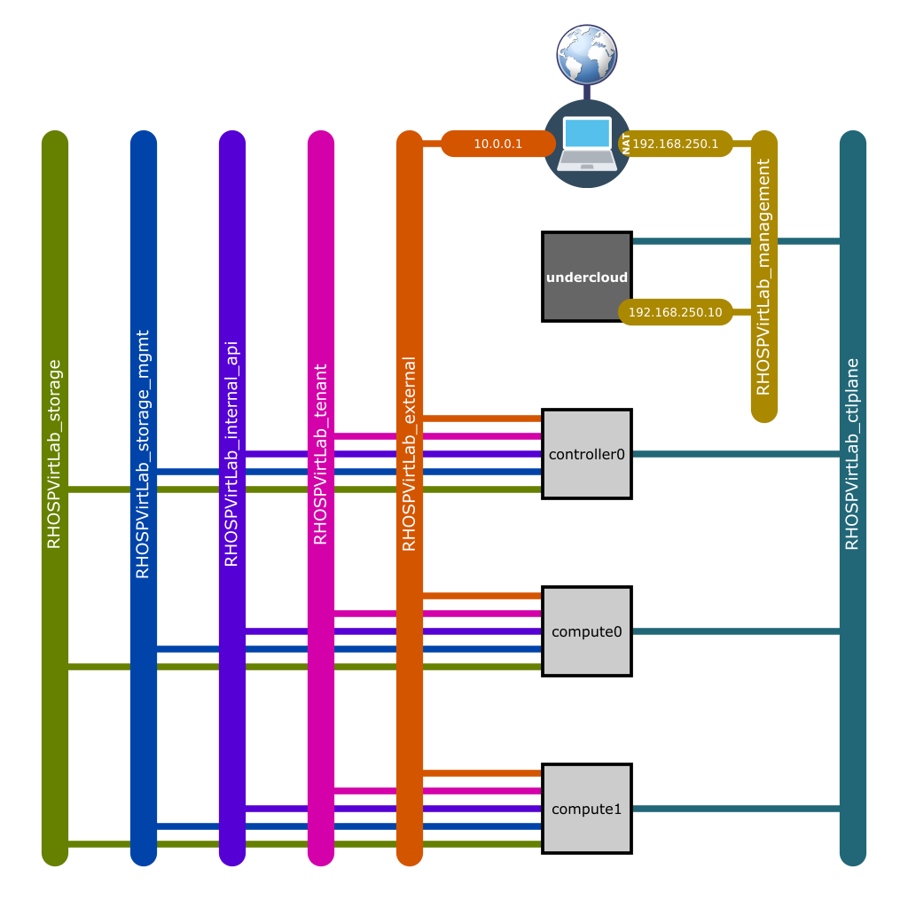
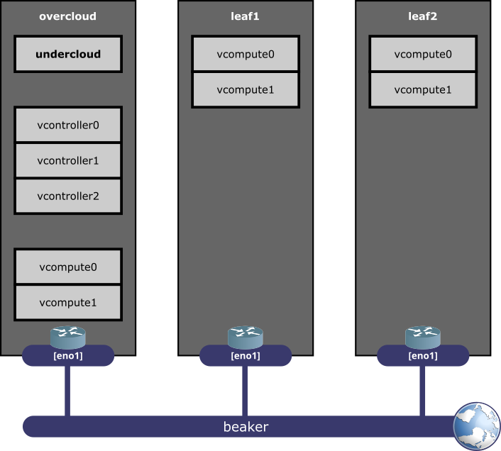
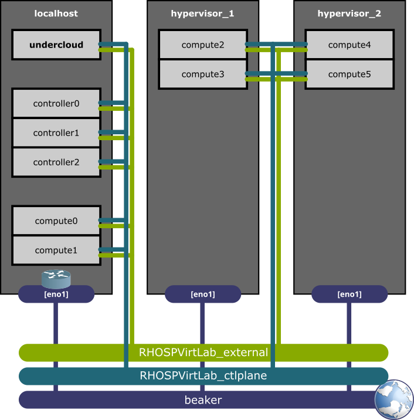
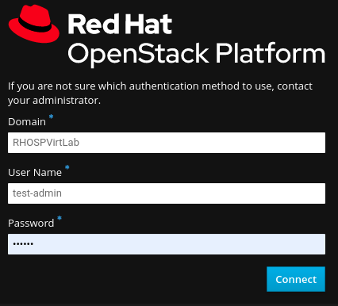
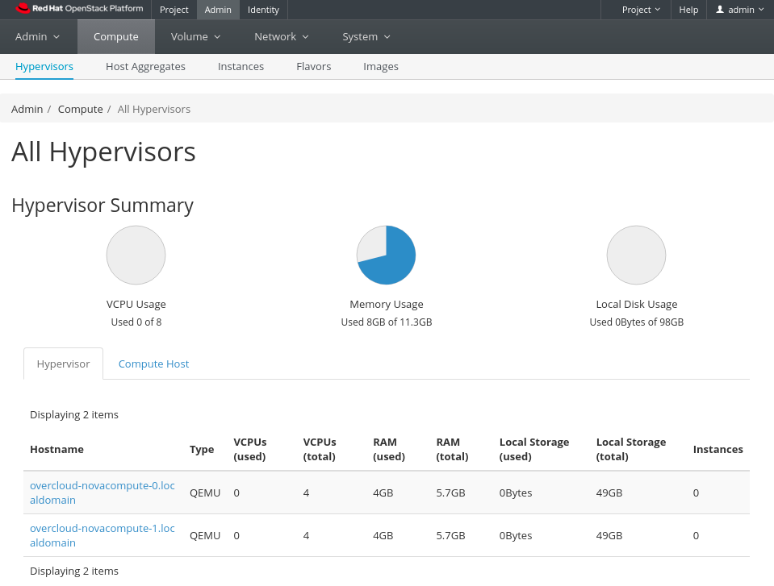

# RHOSP Virtual Lab

Virtual lab to setup a Red Hat OpenStack Platform test installation over a RHEL Hypervisor.

Currently supported RHOSP versions:

- **17.1** (default)
- 16.2

## Assumptions

This document assumes that you run a **RHEL installation** in your server, in one of the following versions:

- **RHEL 10.2**
- **RHEL 9.6**
- **RHEL 8.4**
- **RHEL 7.9**

The steps for other OS versions may differ from the exposed here. Some bugs may appear due to compatibility of packages.

Your server must fulfill the following **minimum requirements**:

  * CPU: 16 cores
  * RAM: 128GB
  * Disk: 350GB of free space

Your server needs to be registered, attached to a valid pool and with the needed repositories enabled. To do that:

- On **RHEL 10.2**:

```bash
sudo subscription-manager register
sudo subscription-manager list --available --all
(select a valid available pool)
sudo subscription-manager attach --pool=<POOL_ID>
sudo subscription-manager release --set=10.2
sudo subscription-manager repos --disable=*
sudo subscription-manager repos --enable=rhel-10-for-x86_64-baseos-rpms \
--enable=rhel-10-for-x86_64-appstream-rpms
sudo dnf update -y
sudo reboot
```

- On **RHEL 9.6**:

```bash
sudo subscription-manager register
sudo subscription-manager list --available --all
(select a valid available pool)
sudo subscription-manager attach --pool=<POOL_ID>
sudo subscription-manager release --set=9.6
sudo subscription-manager repos --disable=*
sudo subscription-manager repos --enable=rhel-9-for-x86_64-baseos-rpms \
--enable=rhel-9-for-x86_64-appstream-rpms
sudo dnf update -y
sudo reboot
```

- On **RHEL 8.4**:

```bash
sudo subscription-manager register
sudo subscription-manager list --available --all
(select a valid available pool)
sudo subscription-manager attach --pool=<POOL_ID>
sudo subscription-manager release --set=8.4
sudo subscription-manager repos --disable=*
sudo subscription-manager repos --enable=rhel-8-for-x86_64-baseos-rpms \
--enable=rhel-8-for-x86_64-appstream-rpms \
--enable=ansible-2.9-for-rhel-8-x86_64-rpms
sudo dnf update -y
sudo reboot
```

- On **RHEL 7.9**:

```bash
sudo subscription-manager register
sudo subscription-manager list --available --all
(select a valid available pool)
sudo subscription-manager attach --pool=<POOL_ID>
sudo subscription-manager repos --disable=*
sudo subscription-manager repos --enable=rhel-7-server-rpms \
--enable=rhel-7-server-extras-rpms \
--enable=rhel-7-server-optional-rpms \
--enable=rhel-7-server-ansible-2.9-rpms \
--enable=rhel-7-server-openstack-13-rpms \
--enable=rhel-7-server-supplementary-rpms
sudo yum update -y
sudo reboot
```

Repeat this in all your hypervisors when you use a DCN or multiple hypervisors configuration.

### Local user configuration

The user from which you will execute the lab needs to have username **admin** and `sudo` **permissions enabled with no password**. To achieve that you need to create a file `/etc/sudoers.d/admin` with the following command:

```
echo "admin ALL=(ALL) NOPASSWD:ALL" | sudo tee /etc/sudoers.d/admin
```

Repeat that **admin** user setup in all your hypervisors when you use a DCN or multiple hypervisors configuration.

### DCN or multiple hypervisors configuration

In the main hypervisor (central) you need to create an ssh-key using the following command (use default options):

```bash
ssh-keygen
```

Then copy that key to all your other hypervisors with:

```bash
ssh-copy-id admin@<hypervisor_address>
```

## Install required and useful packages

- On **RHEL 10.2**:

```bash
sudo dnf -y install git vim wget bash-completion python3-argcomplete python3-netaddr rhel-system-roles tmux tcpdump
```

- On **RHEL 9.6**:

```bash
sudo dnf -y install git vim wget bash-completion python3-argcomplete python3-netaddr rhel-system-roles tmux tcpdump
```

- On **RHEL 8.4**:

```bash
sudo dnf -y install git ansible vim wget bash-completion python3-argcomplete python3-netaddr rhel-system-roles tmux tcpdump
```

- On **RHEL 7.9**:

```bash
sudo yum -y install git ansible vim wget bash-completion python2-netaddr rhel-system-roles tmux tcpdump
```

Repeat this in all your hypervisors when you use a DCN or multiple hypervisors configuration.

## Pull the repo

Move to a directory where you want to work, for example the home directory:

```bash
cd ~
```

Clone the repository and enter the directory.

```bash
git clone https://github.com/yampilop/RHOSPVirtLab.git
cd RHOSPVirtLab
```

## Initial configurations

#### Inventory for DCN or multiple hypervisors configuration

You need to add all your hypervisors in the `./inventory` file in the following way:

```
[infrastructure]
localhost ansible_host=localhost ansible_connection=local ansible_become=yes
<hypervisor1_name> ansible_host=<hypervisor1_address> ansible_user=admin ansible_become=yes ansible_ssh_extra_args='-o StrictHostKeyChecking=no' hypervisor_external_if=<hypervisor1_external_interface_name>
<hypervisor2_name> ansible_host=<hypervisor2_address> ansible_user=admin ansible_become=yes ansible_ssh_extra_args='-o StrictHostKeyChecking=no' hypervisor_external_if=<hypervisor2_external_interface_name>
...
```

### Test user and ansible installation

```bash
ansible infrastructure -m ping
```

```
hypervisor | SUCCESS => {
    "ansible_facts": {
        "discovered_interpreter_python": "/usr/libexec/platform-python"
    },
    "changed": false,
    "ping": "pong"
}
```

For DCN or multiple hypervisors deployments you need to see a similar output for all the hypervisors:

```
hypervisor_name | SUCCESS => {
    "ansible_facts": {
        "discovered_interpreter_python": "/usr/libexec/platform-python"
    },
    "changed": false,
    "ping": "pong"
}
...
```

### Install requirements

```bash
ansible-galaxy collection install -r requirements.yml
ansible-galaxy install -r requirements.yml
```

## Create a vault for credentials

You need to create a vault file to store your Red Hat Subscription credentials. To do that, execute the following command:

```bash
ansible-vault create vault_credentials.yaml
```

You will write the credentials in the following format:

```yml
rh_username: '<USERNAME>'
rh_password: '<PASSWORD>'
```

To avoid your credentials to be written in text files, you can use the following format:

```yml
rh_pool: '<POOL_ID_TO_ATTACH_SUBSCRIPTIONS>'
rh_orgid: '<ORG_ID>'
rh_activationkey: '<ACTIVATION_KEY>'
rh_serviceaccount: '<SERVICE_ACCOUNT>'
rh_token: '<TOKEN>'
```

`rh_pool` is optional to be used instead of autoattach.
`rh_orgid` and `rh_activationkey` are used in the case an Activation Key is created for subscription-manager.
`rh_serviceaccount` and `rh_token` are used in the case a Registry Service Account is created to use with the container registry (in order not to use the credentials in plain text files).

## Clean the installation

To start/restart the installation from scratch, you can edit the options.yml file and set `cleanup: True` instead of `False`.

You can also add `--extra-vars "cleanup=True"` to the ansible-playbook command.

## Execute the Ansible Playbook

Execute the playbook with the following command (you will be prompted for the user password and the vault password):

```bash
ansible-playbook --ask-vault-pass playbook.yml
```

The playbook sets up the following environment:





## DCN deployment

When using DCN Leafs, the playbook sets up the following environment:



## Multiple hypervisors deployment

When using multiple hypervisors for a single leaf, list them (comma-separated) in the
`hypervisor` field of the control-plane leaf (`overcloud`) in the `leafs` variable this way:

```yaml
leafs:
- name: overcloud
  hypervisor: localhost,<hypervisor1_name>,<hypervisor2_name>,...
  ...
```

The playbook sets up the following environment:



### Customizing the environment

If you want to customize the default environment created by the playbook, you need to edit the files:

- `vars/machines.yml` (The unified inventory of lab machines: both libvirt VMs and physical baremetal nodes)
- `vars/options.yml` (Customizable parameters like the version of RHOSP to deploy, the cleanup parameter, the `leafs` and `RoleBridgeMappings` networking model, etc.)

You also can add to vars/options.yml any value overriding the default values from the roles.

The `leafs`, `RoleBridgeMappings` and derived-network (`Networks`) model is documented
field by field in the role READMEs (`roles/RHOSP-undercloud/README.md` and
`roles/RHOSP-virt-infra/README.md`). The virtual networks are no longer configured in a
separate file: they are derived from the `leafs` model (plus the management NAT network).

#### The unified machines model

Both the virtual machines (previously in `vars/vms.yml`) and the physical baremetal
nodes (previously in `vars/physical.yml`) are now defined in a single list in
`vars/machines.yml`. Every entry shares a common set of top-level parameters and is
tagged with a `type` discriminator (`libvirt` for VMs, `physical` for baremetal).
Technology-specific parameters live in a block named after that type. This makes it
straightforward to add new virtualization technologies later: define a new `type` and
a matching block.

Common top-level parameters (all types):

```yaml
- name: undercloud          # Unique machine name
  type: libvirt             # libvirt | physical
  pre_provisioned: true     # true = OS already loaded; false = ironic provisions later
  openstack:
    role: undercloud        # Overcloud role/profile (or 'undercloud')
    leaf: overcloud         # Leaf/DCN site (mainly for physical nodes)
  pm:                       # Power management / BMC (both types)
    type: ipmi              # BMC driver
    user: admin
    password: admin
    address: localhost      # localhost/hypervisor for VMs, IPMI address for baremetal
    port: 6230              # virtualbmc port for VMs
    mode: bios              # bios | uefi (also drives introspection boot_mode)
```

A `libvirt` machine adds a `libvirt:` block:

```yaml
  libvirt:
    title: 'RHOSPVirtLab Undercloud'
    hypervisor: localhost   # Inventory host that runs the domain
    cpus: 4
    memory: 16777216        # RAM in KiB
    disks:                  # One or more disks; exactly one root
    - root: true
      size: 107374182400    # bytes
    - size: 53687091200     # additional data disk(s), any number
    network:
      interfaces:           # Each NIC attaches directly to a hypervisor bridge
      - name: nic1
        mac: '0c:1f:0d:10:00:00'
        bridge: br-ctlplane
      - name: mgmt          # access NIC: detected by the name `mgmt` (see below)
        mac: '0c:1f:0d:10:00:02'
        bridge: br-management
```

A `physical` machine adds a `physical:` block:

```yaml
  physical:
    cpus: 4
    memory: 4194304         # RAM in KiB
    disk: 53687091200       # bytes
    mac: '52:54:00:24:61:07'   # boot NIC MAC (used for introspection)
    nics:                   # logical-nic -> physical device map for os-net-config
      nic1: 'ens1f0'
      nic2: 'ens1f1'
```

Notes on the new model:

- **Disks are virtio.** All data/root disks are attached on the `virtio` bus (`vd*`).
  Add as many data disks as you need by listing more entries under `disks:` (e.g. for
  ceph/computehci profiles).
- **`pre_provisioned` drives both the backing image and cloud-init.** The single common
  flag `pre_provisioned` (top level, works for VMs and physical nodes) records whether a
  node already has an OS loaded ("deployed server") or will be provisioned later by ironic
  (unprovisioned, the default). The undercloud is always `pre_provisioned: true`; overcloud
  machines default to unprovisioned but can opt in "the same way as the undercloud". For a
  **pre_provisioned libvirt VM** the playbook (a) backs the root disk with the RHEL base
  image and populates it with `virt-resize`, and (b) builds a per-machine NoCloud (cidata)
  ISO — `<machine>-init.iso` — from `user-data` / `meta-data` / `network-config` and
  attaches it as a SATA cdrom. The cloud-init login user is `stack` for the undercloud role
  and the overcloud SSH user for the rest (`heat-admin` on 16.2, `tripleo-admin` on 17.1).
  When the machine has an interface named `mgmt`, its inventory `ansible_host` address
  is seeded through `network-config`. An **unprovisioned** VM gets empty disks and no
  cloud-init cdrom. There is no separate `cloud_init` or per-disk `backing_store` setting.
- **NICs attach to bridges directly.** Each interface names the hypervisor `bridge` it
  attaches to (a leaf's `ctlplane_bridge`/`additional_bridges`, or the management bridge),
  decoupling machines from the networks. All interfaces are rendered as `type=bridge`;
  guests that need NAT simply attach to the libvirt-managed NAT bridge, so NAT still works
  without a dedicated NIC type.

#### Management/access IP (SSH) — VM vs physical undercloud

The undercloud can be **either a libvirt VM or a physical machine**. In both cases the
access/management IP used by Ansible to SSH in is **not hardcoded** in
`vars/machines.yml`; it comes from the machine's entry in the `./inventory` file
(`ansible_host`), which is the single source of truth.

- On a **libvirt undercloud**, the role injects the access NIC (named `mgmt`)
  automatically, so it is not listed in the `undercloud` variable. On other libvirt
  machines, add the access NIC by naming an interface `mgmt` (the NIC is detected by
  name). cloud-init applies the inventory `ansible_host` address statically to that
  interface at first boot (a `/24` prefix is assumed), and os-net-config later reuses
  the same address for that interface.
- On a **physical undercloud**, the machine already boots with its own address; Ansible
  simply uses the inventory `ansible_host` to reach it. No cloud-init addressing is
  applied.

Either way, adjust the undercloud line in `./inventory` to the IP you want to reach it
on, for example:

```
[openstack]
undercloud ansible_host=192.168.250.10 ansible_user=stack ...
```

#### Customizing images

- Use a valid URL to the qcow2 image file:
  - `CustomRhelImage: "<url>"`
  - `CustomCirrOSImage: "<url>"`
- Download the image and use the path to the file:
  - `CustomRhelImage: "file://<full_path>"`
  - `CustomCirrOSImage: "file://<full_path>"`
  As you need to use the full path, the value will have a triple dash, for instance `"file:///home/admin/rhel.qcow2"`

#### Customizing networks

- The default configuration should work for most cases.
- If you will add physical nodes, trunk a real hypervisor NIC into the leaf bridges by setting the `interface` field on the control-plane leaf's `ctlplane_bridge` and the relevant `additional_bridges` (e.g. `br-external`) in the `leafs` variable. Make sure those interfaces are configured as trunks with a native vlan in the switch.

#### Customizing VMs (`type: libvirt`)

- The default configuration considers an undercloud, and commented-out examples for
  virtual controllers and compute nodes. Uncomment/add or remove entries in
  `vars/machines.yml` making sure the following parameters are unique in each record:
    - `name`
    - `pm.port` (the virtualbmc port)
    - each interface `mac`
- Make sure you use only virtual-capable profiles (`openstack.role`) for the VMs, or the playbook will fail. The available virtual profiles are the ones with `virtual: True` in the `overcloud_roles` variable from `roles/RHOSP-undercloud/vars/main.yml`.
- For ceph or computehci related profiles, add extra data disks by appending more entries under the machine's `libvirt.disks:` list (each with a `size` in bytes). All disks use the virtio bus.
- Make sure you perform the calculations to use the hypervisor physical resources (CPU, RAM and DISK) properly, leaving some of them for the hypervisor itself (for example leaving 4 cpus and 16GB of RAM).
- Make sure you use only distributed-capable profiles for the VMs in leafs, or the playbook will fail. The available distributed profiles are the ones with `distributed: True` in the `overcloud_roles` variable from `roles/RHOSP-undercloud/vars/main.yml`.

#### Customizing physical machines (`type: physical`)

- The default configuration considers no physical nodes (see the commented example at the bottom of `vars/machines.yml`).
- Set the `pm.*` power management parameters matching your servers configuration, and the `physical.nics` map matching the server's interface names.

#### Customizing options

This are the mandatory parameter you most probably need to customize:

- Set the version you will install using the `RHOSP_version` parameter.
- Set the `external_if` parameter to the hypervisor external interface name.
- Set reachable and working servers in `dns_servers` and `ntp_servers`.
- Set the proper interfaces names, specially for the physical roles, to avoid network configuration issues. For example:

```yaml
  ComputeSriov:
    ControlPlane: ens1f0
    External: ens1f1v0
    Sriov:
      - device: ens1f1
        numvfs: 8
```

- Set the proper parameters for NFV roles in `ComputeSriovProperties`, `ComputeOvsHwOffloadProperties`, `ComputeOvsDpdkProperties` and/or `ComputeOvsDpdkSriovProperties`.
- Choose to deploy Octavia with `DeployOctavia: True`.
- Choose to deploy Designate with `DeployDesignate: True`.
- Choose to deploy FRR with `DeployFrr: True`.
- Choose to register the nodes with `RegisterNodes: True`.

#### DCN leafs customization

For DCN leafs you need the following customizations to the vars files:

- `vars/options.yml`:
    - Add a leaf entry to the `leafs` list (after the control-plane `overcloud` leaf), with its own `hypervisor`, `ctlplane_bridge`, `ctlplane_subnet`, `additional_bridges` and `networks`. The underlying libvirt networks/bridges are derived from this model, so there is no separate networks file to edit. The full leaf schema and a complete DCN example are in the role README (`roles/RHOSP-undercloud/README.md`, the `leafs` section). For example:

```yaml
leafs:
- name: overcloud            # control-plane leaf (as shipped)
  ...
- name: leaf1                # DCN leaf
  hypervisor: hypervisor_name
  additional_bridges:
  - name: br-external
    interface: null          # set to a NIC name to trunk a physical uplink into the bridge
    ipv4:
      address: 10.1.0.254
  ctlplane_bridge:
    name: br-ctlplane
    interface: null          # set to a NIC name to attach physical nodes to this leaf
  ctlplane_subnet:
    name: leaf1-subnet
    cidr: 192.168.25.0/24
    dhcp_start: 192.168.25.5
    dhcp_end: 192.168.25.99
    inspection_iprange: 192.168.25.100,192.168.25.120
    gateway: 192.168.25.254
    masquerade: false
  networks:                  # same shape as the overcloud leaf, on the leaf's subnets
  - name: Tenant
    bridge: br-ctlplane
    vip: false
    mtu: 1500
    subnet:
      ip_subnet: 172.17.0.0/24
      allocation_pools:
      - start: 172.17.0.5
        end: 172.17.0.99
      vlan: 10
  # ... Storage, InternalApi, StorageMgmt, External (see the role README)
```

- `vars/machines.yml`:
    - **Do not use `pm.mode: uefi` in DCN leafs VMs** because introspection and deployment won't work due to a tftp known problem with firewalld.
    - Create VMs (`type: libvirt`) with `libvirt.hypervisor: {{hypervisorname}}`, consistent configuration and interfaces attached to the proper leaf bridges, for example:

```yaml
  - name: compute0
    type: libvirt
    openstack:
      role: compute
    pm:
      type: ipmi
      user: admin
      password: admin
      address: hypervisor_name
      port: 6230
      mode: bios
    libvirt:
      title: 'RHOSPVirtLab Leaf1 Virtual Compute 0'
      hypervisor: hypervisor_name
      cpus: 26
      memory: 92272640
      disks:
      - root: true
        size: 157374182400
      network:
        interfaces:
        - name: nic1
          mac: '0c:1f:0d:12:02:00'
          bridge: br-ctlplane
        - name: nic2
          mac: '0c:1f:0d:12:02:05'
          bridge: br-external
```

    - Create physical nodes (`type: physical`) with `openstack.leaf: {{leaf.name}}` and the proper configuration, for example:

```yaml
  - name: computeovsdpdksriov0
    type: physical
    openstack:
      role: computeovsdpdksriov
      leaf: leaf1
    pm:
      type: ipmi
      user: username
      password: password
      address: XXX.XXX.XXX.XXX
      port: 623
      mode: uefi
    physical:
      cpus: 64
      memory: 263874784
      disk: 599577434521
      mac: 'XX:XX:XX:XX:XX:XX'
      nics:
        nic1: 'ens1f0'
        nic2: 'ens1f1'
```

## Multiple hypervisors customization

When using multiple hypervisors for a single leaf you need the following customizations to the vars files:

- `vars/options.yml`:
    - List all the hypervisors (comma-separated) in the `hypervisor` field of the control-plane leaf (`overcloud`) in the `leafs` variable. The leaf's bridges are then derived and created on every listed hypervisor:

```yaml
leafs:
- name: overcloud
  hypervisor: localhost,hypervisor_name
  ...
```

- `vars/machines.yml`:
    - Create VMs (`type: libvirt`) with `libvirt.hypervisor: {{hypervisorname}}`, consistent configuration and interfaces attached to the leaf bridges, for example:

```yaml
  - name: compute0
    type: libvirt
    openstack:
      role: compute
    pm:
      type: ipmi
      user: admin
      password: admin
      address: hypervisor_name
      port: 6230
      mode: bios
    libvirt:
      title: 'RHOSPVirtLab Virtual Compute 0'
      hypervisor: hypervisor_name
      cpus: 26
      memory: 92272640
      disks:
      - root: true
        size: 157374182400
      network:
        interfaces:
        - name: nic1
          mac: '0c:1f:0d:12:02:00'
          bridge: br-ctlplane
        - name: nic2
          mac: '0c:1f:0d:12:02:05'
          bridge: br-external
```

## Last steps

As the `undercloud` installation and `overcloud` deploy are tasks that last longer and require attention due to possible failures, they need to be executed manually. To do that, login to the `undercloud`:

```bash
ssh stack@undercloud
```

### Install the undercloud

Execute the following command:

```bash
openstack undercloud install
```

Wait for the process to finish with the following output:

```
########################################################

Deployment successful!

########################################################

Writing the stack virtual update mark file /var/lib/tripleo-heat-installer/update_mark_undercloud

##########################################################

The Undercloud has been successfully installed.

Useful files:

Password file is at /home/stack/undercloud-passwords.conf
The stackrc file is at ~/stackrc

Use these files to interact with OpenStack services, and
ensure they are secured.

##########################################################
```

### Pre-deployment actions

For most cases it is available a script with all the common pre-deployment tasks. Run it using:

```bash
/home/stack/pre_deployment.sh
```

If you want a customized experience, consider reviewing the script and executing the tasks manually.

If you added DCN leafs, execute the corresponding `pre_deployment.sh` scripts:

```bash
/home/stack/templates/{{leaf.name}}/pre_deployment.sh
```

### Deployment

Execute the deployment script provided:

```bash
/home/stack/deploy.sh
```

If you want a customized experience, consider reviewing the script and executing the task manually.

The output should end with the following:

```
Ansible passed. Overcloud configuration completed.
Overcloud Endpoint: http://10.0.0.253:5000
Overcloud Horizon Dashboard URL: http://10.0.0.253:80/dashboard
Overcloud rc file: /home/stack/overcloudrc
Overcloud Deployed without error
```

Analyze the Overcloud rc file to take note of the admin password:

```bash
grep PASSWORD overcloudrc
```

```
export OS_PASSWORD=XXXXXXXXXXXXXX
```

If you added DCN leafs, execute the corresponding `deploy.sh` scripts:

```bash
/home/stack/templates/{{leaf.name}}/deploy.sh
```

### Post-deployment actions

Execute the script to create basic resources:

```bash
/home/stack/post_deployment.sh
```

### Open dashboard

From a web browser, open the Overcloud Horizon Dashboard URL pointing to the hypervisor IP/domain name (http://HYPERVISOR:80/dashboard) and login as **test-admin** using the password **redhat**.





### Undeploy

Execute the script to delete the stacks, undeploy and clean all the servers:

```bash
/home/stack/undeploy.sh
```

