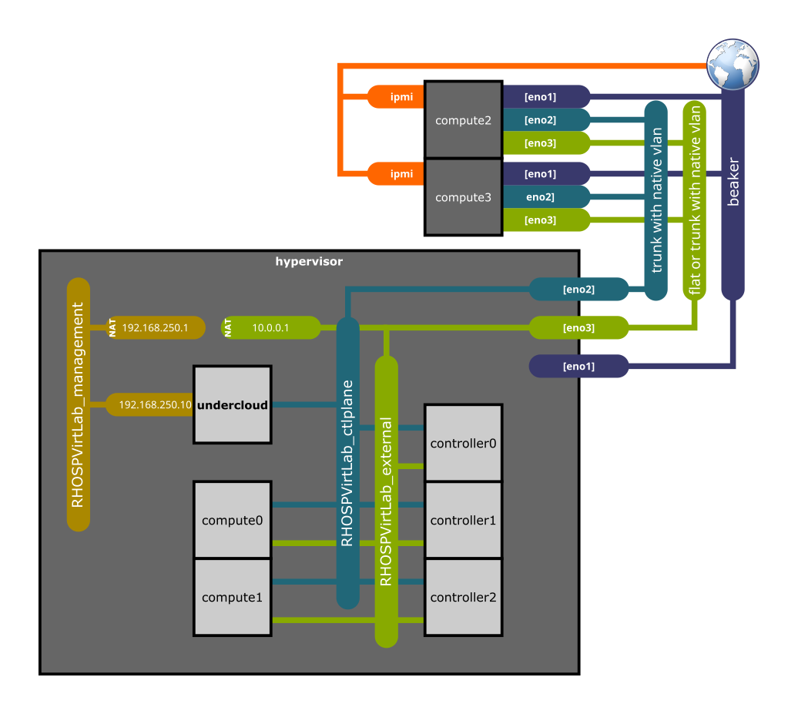
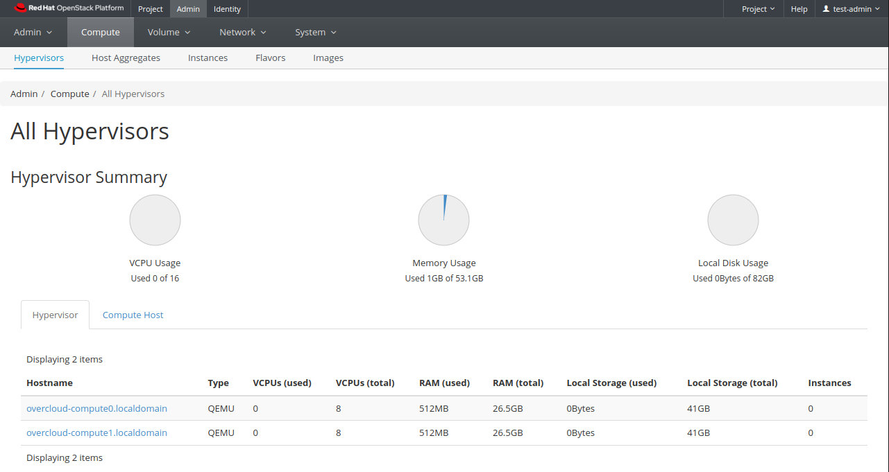

# RHOSP Virtual Lab

Virtual lab to setup a Red Hat OpenStack Platform test installation over a RHEL Hypervisor.

Currently supported RHOSP versions:

- **17.1** (default)
- 17.0
- 16.2
- 16.1
- 13.0

## Assumptions

This document assumes that you run a **RHEL 8.4** or **RHEL 7.9** installation in your server. The steps for other OS versions may differ from the exposed here.

Your server must fulfill the following **minimum requirements**:

  * CPU: 16 cores
  * RAM: 128GB
  * Disk: 350GB of free space

Your server needs to be registered and attached to a valid pool. To do that:

- On **RHEL 8.4**:

```bash
sudo subscription-manager register
sudo subscription-manager list --available --all
(select a valid available pool)
sudo subscription-manager attach --pool=<POOL_ID>
sudo subscription-manager release --set=8.4
sudo subscription-manager repos --disable=*
sudo subscription-manager repos --enable=rhel-8-for-x86_64-baseos-rpms \
--enable=rhel-8-for-x86_64-appstream-rpms \
--enable=ansible-2.9-for-rhel-8-x86_64-rpms
sudo dnf update -y
sudo reboot
```

- On **RHEL 7.9**:

```bash
sudo subscription-manager register
sudo subscription-manager list --available --all
(select a valid available pool)
sudo subscription-manager attach --pool=<POOL_ID>
sudo subscription-manager repos --disable=*
sudo subscription-manager repos --enable=rhel-7-server-rpms \
--enable=rhel-7-server-extras-rpms \
--enable=rhel-7-server-optional-rpms \
--enable=rhel-7-server-ansible-2.9-rpms \
--enable=rhel-7-server-openstack-13-rpms \
--enable=rhel-7-server-supplementary-rpms
sudo yum update -y
sudo reboot
```

Repeat this in all your hypervisors when you use a DCN or multiple hypervisors configuration.

### Local user configuration

The user from which you will execute the lab needs to have username **admin** and `sudo` **permissions enabled with no password**. To achieve that you need to create a file `/etc/sudoers.d/admin` with the following command:

```
echo "admin ALL=(ALL) NOPASSWD:ALL" | sudo tee /etc/sudoers.d/admin
```

Repeat that **admin** user setup in all your hypervisors when you use a DCN or multiple hypervisors configuration.

### DCN or multiple hypervisors configuration

In the main hypervisor (central) you need to create an ssh-key using the following command (use default options):

```bash
ssh-keygen
```

Then copy that key to all your other hypervisors with:

```bash
ssh-copy-id admin@<hypervisor_address>
```

## Install required and useful packages

- On **RHEL 8.4**:

```bash
sudo dnf -y install git ansible vim wget bash-completion python3-argcomplete python3-netaddr rhel-system-roles tmux tcpdump
```

- On **RHEL 7.9**:

```bash
sudo yum -y install git ansible vim wget bash-completion python2-netaddr rhel-system-roles tmux tcpdump
```

Repeat this in all your hypervisors when you use a DCN or multiple hypervisors configuration.

## Pull the repo

Move to a directory where you want to work, for example the home directory:

```bash
cd ~
```

Clone the repository and enter the directory.

```bash
git clone https://github.com/yampilop/RHOSPVirtLab.git
cd RHOSPVirtLab
```

## Initial configurations

#### Inventory for DCN or multiple hypervisors configuration

You need to add all your hypervisors in the `./inventory` file in the following way:

```
[infrastructure]
localhost ansible_host=localhost ansible_connection=local ansible_become=yes
<hypervisor1_name> ansible_host=<hypervisor1_address> ansible_user=admin ansible_become=yes ansible_ssh_extra_args='-o StrictHostKeyChecking=no' hypervisor_external_if=<hypervisor1_external_interface_name>
<hypervisor2_name> ansible_host=<hypervisor2_address> ansible_user=admin ansible_become=yes ansible_ssh_extra_args='-o StrictHostKeyChecking=no' hypervisor_external_if=<hypervisor2_external_interface_name>
...
```

### Test user and ansible installation

```bash
ansible infrastructure -m ping
```

```
hypervisor | SUCCESS => {
    "ansible_facts": {
        "discovered_interpreter_python": "/usr/libexec/platform-python"
    },
    "changed": false,
    "ping": "pong"
}
```

For DCN or multiple hypervisors deployments you need to see a similar output for all the hypervisors:

```
hypervisor_name | SUCCESS => {
    "ansible_facts": {
        "discovered_interpreter_python": "/usr/libexec/platform-python"
    },
    "changed": false,
    "ping": "pong"
}
...
```

### Install requirements

```bash
ansible-galaxy collection install -r requirements.yml
ansible-galaxy install -r requirements.yml
```

## Create a vault for credentials

You need to create a vault file to store your Red Hat Subscription credentials. To do that, execute the following command:

```bash
ansible-vault create vault_credentials.yaml
```

You will write the credentials in the following format:

```yml
rh_username: '<USERNAME>'
rh_password: '<PASSWORD>'
```

To avoid your credentials to be written in text files, you can use the following format:

```yml
rh_pool: '<POOL_ID_TO_ATTACH_SUBSCRIPTIONS>'
rh_orgid: '<ORG_ID>'
rh_activationkey: '<ACTIVATION_KEY>'
rh_serviceaccount: '<SERVICE_ACCOUNT>'
rh_token: '<TOKEN>'
```

`rh_pool` is optional to be used instead of autoattach.
`rh_orgid` and `rh_activationkey` are used in the case an Activation Key is created for subscription-manager.
`rh_serviceaccount` and `rh_token` are used in the case a Registry Service Account is created to use with the container registry (in order not to use the credentials in plain text files).

## Clean the installation

To start/restart the installation from scratch, you can edit the options.yml file and set `cleanup: True` instead of `False`.

You can also add `--extra-vars "cleanup=True"` to the ansible-playbook command.

## Execute the Ansible Playbook

Execute the playbook with the following command (you will be prompted for the user password and the vault password):

```bash
ansible-playbook --ask-vault-pass playbook.yml
```

The playbook sets up the following environment:




## DCN deployment

When using DCN Leafs, the playbook sets up the following environment:


## Multiple hypervisors deployment

When using multiple hypervisors for a single leaf, add your hypervisor to the `DefaultLeaf0` variable in `vars/options.yaml` this way:

```yaml
# Default leaf configuration
DefaultLeaf0:
  name: overcloud
  hypervisor: localhost,<hypervisor1_name>,<hypervisor2_name>,...
  subnet:
...
```

The playbook sets up the following environment:


### Customizing the environment

If you want to customize the default environment created by the playbook, you need to edit the files:

- `vars/networks.yml` (The virtual networks and their connection to the physical interfaces of the hypervisor)
- `vars/vms.yml` (The VMs to be created in the hypervisors)
- `vars/physical.yml` (The physical nodes to be added as baremetal nodes in the undercloud)
- `vars/options.yml` (Customizable parameters like the version of RHOSP to deploy, the cleanup parameter, etc.)

You also can add to vars/options.yml any value overriding the default values from the roles.

#### Customizing RHEL image

If you are not connected to the Red Hat VPN, you will need to download the RHEL base image from somewhere else. To do so you can either:

- Use a valid URL to the qcow2 image file (`CustomRhelImage: "<url>"`).
- Download the image and use the path to the file (`CustomRhelImage: "file://<full_path>"`). As you need to use the full path, the value will have a triple dash, for instance `"file:///home/admin/rhel.qcow2"`

#### Customizing networks

- The default configuration should work for most cases.
- If you will add physical nodes, you need to define `hypervisor_if: {{ifname}}` parameter on `RHOSPVirtLab_ctlplane` and `RHOSPVirtLab_external` networks, setting the interfaces that will be attached to the bridges. Make sure those interfaces are configured as trunks with a native vlan in the switch.

#### Customizing VMs

- The default configuration considers an undercloud, 3 virtual controllers and 2 virtual compute nodes. Add or remove nodes making sure the following parameters are unique in each record:
    - name
    - bmcport
    - mac (this is the base MAC address without the last byte)
- Make sure you use only virtual capable profiles for the vms, or the playbook will fail. The available virtual profiles are the ones with `virtual: True` in `overcloud_roles` variable from `roles/RHOSP-undercloud/vars/main.yml`
- For the case of ceph or computehci related profiles, you can add a second virtual disk to the VM with the parameter `data_disk_size: SIZE_IN_BYTES`.
- Make sure you perform the calculations to use the hypervisor physical resources (CPU, RAM and DISK) properly, leaving some of them for the hypervisor itself (for example leaving 4 cpus and 16GB of RAM).
- Make sure you use only distributed capable profiles for the vms in leafs, or the playbook will fail. The available distributed profiles are the ones with `distributed: True` in `overcloud_roles` variable from `roles/RHOSP-undercloud/vars/main.yml`

#### Customizing physical machines

- The default configuration considers no physical nodes.
- Set the power management parameters matching your servers configuration.

#### Customizing options

This are the mandatory parameter you most probably need to customize:

- Set the version you will install using the `RHOSP_version` parameter.
- Set the `external_if` parameter to the hypervisor external interface name.
- Set reachable and working servers in `dns_servers` and `ntp_servers`.
- Set the proper interfaces names, specially for the physical roles, to avoid network configuration issues. For example:

```yaml
  ComputeSriov:
    ControlPlane: ens1f0
    External: ens1f1v0
    Sriov:
      - device: ens1f1
        numvfs: 8
```

- Set the proper parameters for NFV roles in `ComputeSriovProperties`, `ComputeOvsHwOffloadProperties`, `ComputeOvsDpdkProperties` and/or `ComputeOvsDpdkSriovProperties`.
- Choose to deploy Octavia with `DeployOctavia: True`.
- Choose to deploy Designate with `DeployDesignate: True`.
- Choose to deploy FRR with `DeployFrr: True`.
- Choose to register the nodes with `RegisterNodes: True`.

#### DCNLeafs customization

For DCN leafs you need the following customizations to the vars files:

- `vars/networks.yml`:
    - `RHOSPVirtLab_ctlplane` and `RHOSPVirtLab_external` should be `forward: bridge`. RHOSPVirtLab_management remains as `forward: nat`.
    - Create `RHOSPVirtLab_ctlplane_{{leaf.name}}` and `RHOSPVirtLab_external_{{leaf.name}}` networks for every leaf, with `forward: bridge` and consistent configuration.
    - Define `hypervisor_if: {{interface_name}}` for both networks if you plan to attach physical nodes to that leaf.

```yaml
  - name: RHOSPVirtLab_ctlplane_leaf1
    hypervisor: hypervisor_name
    bridge: br-ctlplane
    forward: bridge
    mac_suffix: '00'
    ipv4:
      address: '192.168.25.1'
      netmask: '255.255.255.0'
      dhcp: false
  - name: RHOSPVirtLab_external_leaf1
    hypervisor: hypervisor_name
    bridge: br-external
    forward: bridge
    mac_suffix: '05'
    ipv4:
      address: '10.1.0.1'
      netmask: '255.255.255.0'
      dhcp: false
```

- `vars/vms.yml`:
    - **Do not use `uefi: true` in DCN leafs VMs** because introspection and deployment won't work due to a tftp known problem with firewalld.
    - Create vms with `hypervisor: {{hypervisorname}}`, consistent configuration and nics related to the proper networks, for example:

```yaml
  - name: compute0
    hypervisor: hypervisor_name
    title: 'RHOSPVirtLab Leaf1 Virtual Compute 0'
    profile: 'compute'
    memory: 92272640
    vcpus: 26
    bmcport: 6230
    mac: '0c:1f:0d:12:02'
    uefi: false
    disk_size: 157374182400
    data_disk_size: 0
    backing_store: ''
    cdrom: ''
    nics:
      RHOSPVirtLab_ctlplane_leaf1: ''
      RHOSPVirtLab_external_leaf1: ''
```

- `vars/physical.yml`:
    - Create physical nodes with `leaf: {{leaf.name}}` and the proper configuration, for example:

```yaml
  - name: computeovsdpdksriov0
    leaf: leaf1
    title: 'RHOSPVirtLab Compute OVS DPDK SR-IOV 0'
    profile: 'computeovsdpdksriov'
    memory: 263874784
    cpus: 64
    pm_type: "ipmi"
    pm_user: "username"
    pm_password: "password"
    pm_addr: "XXX.XXX.XXX.XXX"
    pm_port: "623"
    mac: 'XX:XX:XX:XX:XX:XX'
    capabilities: 'boot_mode:uefi'
    disk_size: 599577434521
    nics:
      nic1: 'ens1f0'
      nic2: 'ens1f1'
```

- `vars/options.yml`:
    - Define your leafs using the `DCNLeafs` list with the proper format, for example:

```yaml
DCNLeafs:
 - name: leaf1
   hypervisor: hypervisor_name
   subnet:
     name: leaf1-subnet
     cidr: 192.168.25.0/24
     dhcp_start: 192.168.25.5
     dhcp_end: 192.168.25.55
     inspection_iprange: 192.168.25.100,192.168.25.120
     gateway: 192.168.25.1
     masquerade: false
   networks:
     Tenant:
       prefix: '172.17.0'
       vlan: 10
       network: RHOSPVirtLab_ctlplane_leaf1
     Storage:
       prefix: '172.17.1'
       vlan: 20
       network: RHOSPVirtLab_ctlplane_leaf1
     InternalApi:
       prefix: '172.17.2'
       vlan: 30
       network: RHOSPVirtLab_ctlplane_leaf1
     StorageMgmt:
       prefix: '172.17.3'
       vlan: 40
       network: RHOSPVirtLab_ctlplane_leaf1
     External:
       prefix: '10.1.0'
       network: RHOSPVirtLab_external_leaf1
     Management:
       prefix: '10.1.1'
       vlan: 60
       network: RHOSPVirtLab_ctlplane_leaf1
```

## Multiple hypervisors customization

When using multiple hypervisors for a single leaf you need the following customizations to the vars files:

- `vars/networks.yml`:
    - `RHOSPVirtLab_ctlplane` and `RHOSPVirtLab_external` should be `forward: bridge`. RHOSPVirtLab_management remains as `forward: nat`.
    - Create `RHOSPVirtLab_ctlplane_{{something}}` and `RHOSPVirtLab_external_{{something}}` networks for every hypervisor, with `forward: bridge`, consistent configuration and no ipv4 addressing, for example:

```yaml
  - name: RHOSPVirtLab_ctlplane_1
    hypervisor: hypervisor_name
    bridge: br-ctlplane
    forward: bridge
    mac_suffix: '00'
  - name: RHOSPVirtLab_external_1
    hypervisor: hypervisor_name
    bridge: br-external
    forward: bridge
    mac_suffix: '05'
```

- `vars/vms.yml`:
    - Create vms with `hypervisor: {{hypervisorname}}`, consistent configuration and nics related to the proper networks, for example:

```yaml
  - name: compute0
    hypervisor: hypervisor_name
    title: 'RHOSPVirtLab Virtual Compute 0'
    profile: 'compute'
    memory: 92272640
    vcpus: 26
    bmcport: 6230
    mac: '0c:1f:0d:12:02'
    uefi: false
    disk_size: 157374182400
    data_disk_size: 0
    backing_store: ''
    cdrom: ''
    nics:
      RHOSPVirtLab_ctlplane_1: ''
      RHOSPVirtLab_external_1: ''
```

## Last steps

As the `undercloud` installation and `overcloud` deploy are tasks that last longer and require attention due to possible failures, they need to be executed manually. To do that, login to the `undercloud`:

```bash
ssh stack@undercloud
```

### Install the undercloud

Execute the following command:

```bash
openstack undercloud install
```

Wait for the process to finish with the following output:

```
########################################################

Deployment successful!

########################################################

Writing the stack virtual update mark file /var/lib/tripleo-heat-installer/update_mark_undercloud

##########################################################

The Undercloud has been successfully installed.

Useful files:

Password file is at /home/stack/undercloud-passwords.conf
The stackrc file is at ~/stackrc

Use these files to interact with OpenStack services, and
ensure they are secured.

##########################################################
```

### Pre-deployment actions

For most cases it is available a script with all the common pre-deployment tasks. Run it using:

```bash
/home/stack/pre_deployment.sh
```

If you want a customized experience, consider reviewing the script and executing the tasks manually.

If you added DCN leafs, execute the corresponding `pre_deployment.sh` scripts:

```bash
/home/stack/templates/{{leaf.name}}/pre_deployment.sh
```

### Deployment

Execute the deployment script provided:

```bash
/home/stack/deploy.sh
```

If you want a customized experience, consider reviewing the script and executing the task manually.

The output should end with the following:

```
Ansible passed. Overcloud configuration completed.
Overcloud Endpoint: http://10.0.0.254:5000
Overcloud Horizon Dashboard URL: http://10.0.0.254:80/dashboard
Overcloud rc file: /home/stack/overcloudrc
Overcloud Deployed without error
```

Analyze the Overcloud rc file to take note of the admin password:

```bash
grep PASSWORD overcloudrc
```

```
export OS_PASSWORD=XXXXXXXXXXXXXX
```

If you added DCN leafs, execute the corresponding `deploy.sh` scripts:

```bash
/home/stack/templates/{{leaf.name}}/deploy.sh
```

### Post-deployment actions

Execute the script to create basic resources:

```bash
/home/stack/post_deployment.sh
```

### Open dashboard

From a web browser, open the Overcloud Horizon Dashboard URL pointing to the hypervisor IP/domain name (http://HYPERVISOR:80/dashboard) and login as **test-admin** using the password **redhat**.




### Undeploy

Execute the script to delete the stacks, undeploy and clean all the servers:

```bash
/home/stack/undeploy.sh
```

