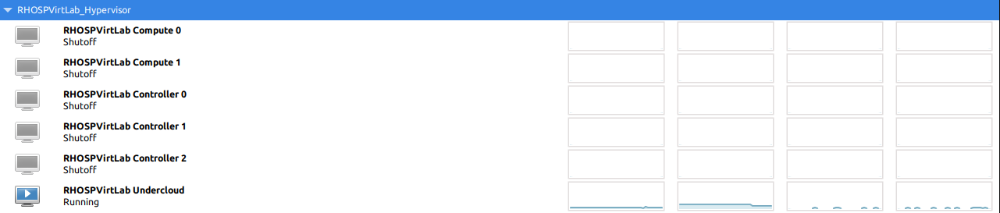
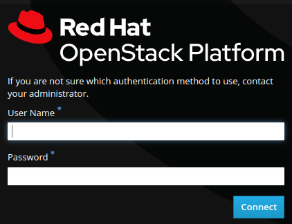

# RHOSP Virtual Lab

Virtual lab to setup a Red Hat OpenStack Platform test installation over a RHEL Hypervisor.

Currently supported RHOSP versions:

- 16.2 (default)
- 16.1
- 13.0

## Assumptions

This document assumes that you run a **RHEL 8.4** installation in your server. The steps for other OS versions may differ from the exposed here.

Your server must fulfill the following **minimum requirements**:

  * CPU: 16 cores
  * RAM: 64GB
  * Disk: 350GB of free space

Your server needs to be registered and attached to a valid pool. To do that:

```bash
sudo subscription-manager register
sudo subscription-manager list --available --all
(select a valid available pool)
sudo subscription-manager attach --pool=<POOL_ID>
sudo subscription-manager release --set=8.4
sudo subscription-manager repos --disable=*
sudo subscription-manager repos --enable=rhel-8-for-x86_64-baseos-rpms \
--enable=rhel-8-for-x86_64-appstream-rpms \
--enable=ansible-2.9-for-rhel-8-x86_64-rpms
sudo dnf update -y
sudo reboot
```

### Local user configuration

The user from which you will execute the lab needs to have `sudo` **permissions enabled with no password**.

## Install required and useful packages

```bash
sudo dnf -y install git ansible vim wget bash-completion python3-argcomplete tmux tcpdump
```

## Pull the repo

Move to a directory where you want to work, for example the home directory:

```bash
cd ~
```

Clone the repository and enter the directory.

```bash
git clone https://github.com/yampilop/RHOSPVirtLab.git
cd RHOSPVirtLab
git fetch
git switch rhel-hypervisor
```

## Initial configurations

### Test user and ansible installation

```bash
ansible infrastructure -m ping
```

```
hypervisor | SUCCESS => {
    "ansible_facts": {
        "discovered_interpreter_python": "/usr/libexec/platform-python"
    },
    "changed": false,
    "ping": "pong"
}
```

### Install requirements

```bash
ansible-galaxy collection install -r requirements.yml
ansible-galaxy install -r requirements.yml
```

## Create a vault for credentials

You need to create a vault file to store your Red Hat Subscription credentials. To do that, execute the following command:

```bash
ansible-vault create vault_credentials.yaml
```

You will write the credentials in the following format:

```yml
rh_username: '<USERNAME>'
rh_password: '<PASSWORD>'
rh_orgid: '<ORG_ID>'
rh_activationkey: '<ACTIVATION_KEY>'
rh_serviceaccount: '<SERVICE_ACCOUNT>'
rh_token: '<TOKEN>'
```

`rh_orgid` and `rh_activationkey` are optional to be used in the case an Activation Key is created for subscription-manager.
`rh_serviceaccount` and `rh_token` are optional to be used in the case a Registry Service Account is created to use with the container registry (in order not to use the credentials in plain text files).

## Clean the installation

To start/restart the installation from scratch, you need to edit the playbook.yml file and set `cleanup: True` instead of `False`.

## Execute the Ansible Playbook

Execute the playbook with the following command (you will be prompted for the user password and the vault password):

```bash
ansible-playbook --ask-vault-pass playbook.yml
```

The playbook sets up the following environment:




### Customizing the environment

If you want to customize the default environment created by the playbook, you need to edit the files:

- vars/networks.yml (The virtual networks and their connection to the physical interfaces of the hypervisor)
- vars/vms.yml (The VMs to be created in the hypervisor)
- vars/physical.yml (The physical nodes to be added as baremetal nodes in the undercloud)
- vars/overcloud.yml (The parameters of the overcloud configuration and the hypervisor forwarded ports)
- vars/version.yml (The version of RHOSP to deploy)

## Last steps

As the `undercloud` installation and `overcloud` deploy are tasks that last longer and require attention due to possible failures, they need to be executed manually. To do that, login to the `undercloud`:

```bash
ssh stack@undercloud
```

### Install the undercloud

Execute the following command:

```bash
openstack undercloud install
```

Wait for the process to finish with the following output:

```
########################################################

Deployment successful!

########################################################

Writing the stack virtual update mark file /var/lib/tripleo-heat-installer/update_mark_undercloud

##########################################################

The Undercloud has been successfully installed.

Useful files:

Password file is at /home/stack/undercloud-passwords.conf
The stackrc file is at ~/stackrc

Use these files to interact with OpenStack services, and
ensure they are secured.

##########################################################
```

### Auto source and completion

To enable auto-sourcing of stackrc file and auto-sourcing of openstack bash completion, do the following:

```bash
openstack complete 2>/dev/null | sed '1d;$d' | sudo tee /usr/share/bash-completion/completions/openstack
cat <<EOF >> /home/stack/.bashrc
source /home/stack/stackrc
source /usr/share/bash-completion/completions/openstack
EOF
```

### Prepare the overcloud

Load the `overcloud` images to openstack:

```bash
source /home/stack/stackrc
openstack overcloud image upload --image-path /home/stack/images/
```

List images:

```bash
openstack image list --fit-width
```

Import the baremetal nodes:

```bash
source /home/stack/stackrc
openstack overcloud node import /home/stack/templates/instackenv.yaml
openstack baremetal node list
```

Introspect the nodes:

```bash
openstack overcloud node introspect --all-manageable --provide
```

After the process finishes, the nodes must be in `available` state:

```bash
openstack baremetal node list
```

Generate the roles file:

```bash
source /home/stack/stackrc
openstack overcloud roles generate \
--roles-path /usr/share/openstack-tripleo-heat-templates/roles \
-o /home/stack/templates/roles_data.yaml \
Controller Compute ComputeSriov
```

Prepare the images for containers:

For 16.X versions:

```bash
source /home/stack/stackrc
sudo openstack tripleo container image prepare -e /home/stack/templates/containers-prepare-parameter.yaml --output-env-file /home/stack/templates/overcloud-images.yaml
```

For 13.0 version (use your Red Hat credentials in the docker login command):

```bash
source /home/stack/stackrc
sudo docker login registry.redhat.io
sudo openstack overcloud container image prepare \
--output-env-file /home/stack/templates/overcloud-images.yaml \
--tag-from-label {version}-{release} \
--namespace=registry.redhat.io/rhosp13 \
--prefix=openstack- \
--push-destination=192.168.24.1:8787 \
--output-images-file /home/stack/local_registry_images.yaml
openstack overcloud container image upload \
--config-file /home/stack/local_registry_images.yaml \
--verbose
```

### Deploy the overcloud

Execute the deploy command with all the templates and environment files:

```bash
source /home/stack/stackrc
openstack overcloud deploy \
--log-file overcloud_deployment.log \
--templates /usr/share/openstack-tripleo-heat-templates/ \
--stack overcloud \
--ntp-server 0.pool.ntp.org,1.pool.ntp.org,2.pool.ntp.org,3.pool.ntp.org \
-r /home/stack/templates/roles_data.yaml \
-n /home/stack/templates/network_data.yaml \
-e /home/stack/templates/node-info.yaml \
-e /home/stack/templates/containers-prepare-parameter.yaml \
-e /home/stack/templates/overcloud-images.yaml \
-e /usr/share/openstack-tripleo-heat-templates/environments/enable-swap.yaml \
-e /usr/share/openstack-tripleo-heat-templates/environments/network-isolation.yaml \
-e /usr/share/openstack-tripleo-heat-templates/environments/network-environment.yaml \
-e /usr/share/openstack-tripleo-heat-templates/environments/net-multiple-nics.yaml \
-e /home/stack/templates/custom-overcloud.yaml
```

The output should end with the following:

```
Ansible passed. Overcloud configuration completed.
Overcloud Endpoint: http://10.0.0.254:5000
Overcloud Horizon Dashboard URL: http://10.0.0.254:80/dashboard
Overcloud rc file: /home/stack/overcloudrc
Overcloud Deployed without error
```

Analyze the Overcloud rc file to take note of the admin password:

```bash
grep PASSWORD overcloudrc
```

```
export OS_PASSWORD=XXXXXXXXXXXXXX
```

### Post deploy configurations

#### Execute the post-deployment script

Execute the script to create basic resources:

```bash
/home/stack/post_deployment.sh
```

### Open dashboard

From a web browser, open the Overcloud Horizon Dashboard URL pointing to the hypervisor IP/domain name (http://HYPERVISOR:80/dashboard) and login to the domain **RHOSPVirtLab** as **test-admin** using the password **redhat**.




